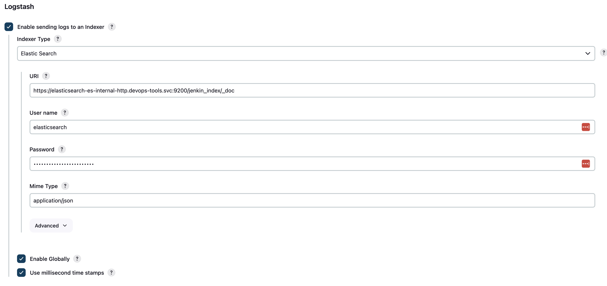

# Monitoring Jenkins build status with Grafana

## General overview:
- Setup Jenkins
- Setup Fluent bit
- Setup Elasticsearch
- Setup Grafana

# Build
1. Start minikube
```bash
minikube start  --cpus 4 --memory 12192 -v 9 --disk-size 60G
```
2. Deploy Elasticsearch (ES). (deploy first to retrieve CA)
```bash
elasticsearch/deploy-elasticsearch.sh
```
Script will output ES password, save password for later use.
```bash
ES Password is HJ33w99JSU3119Ug22OcWSav
```
- Create truststore for Jenkins to ES endpoint
```bash
ssl/create-pkcs12.sh
```

3. Deploy Jenkins
```bash
jenkins/deploy-jenkins.sh
```
Script will output Jenkins initial password, take note of the password.
```bash
Sun Mar 24 08:18:38 EDT 2024 Jenkins init password
830ef00dd5744bf3933d3fe13f62b864
```
Install `stress` etc. on Jenkins pod
```bash
export JPOD_NAME=$(kubectl get pods | grep jenkins- | cut -d' ' -f1 ) ; echo $JPOD_NAME

kubectl cp jenkins/pod-install.sh $JPOD_NAME:/tmp/pod-install.sh
kubectl cp jenkins/deploy-tomcat.yml $JPOD_NAME:/tmp/deploy-tomcat.yml

# login and execute install 
docker exec -it minikube /bin/bash
# get pod iamge id while on minikube 
docker ps | grep jenkins
# login with ID
docker exec -t -i --user root 759e896e4ffe /bin/bash
cd tmp ; chmod 777 * ; /tmp/pod-install.sh
```
- Login to Jenkins using passwword from previous output and add plugins:
- Add logstash plugin, configure with URL:
```BASH
https://elasticsearch-es-internal-http.devops-tools.svc:9200/jenkin_index/_doc
# JVM Truststore was configured during deployment 
```


- Add `Build Timestamp` plugin
- Configure a job using content from `jenkins/jenkins-build-script.sh`
4. Deploy Fluent Bit
- Manually update `HTTP_Passwd` in `fluent-bit/fluent-bit-configmap.yaml` to the ES password
- Deploy Fluent Bit
```bash
fluent-bit/deploy-fluentbit.sh
```
5. Deploy Grafana
```bash
grafana/deploy-grafana.sh
```
- Login to Grafana with user `admin` and password `admin`
- Configure datasource for Jenkins indeces
- Configure datasource for CPU indeces
```bash
# Use URL
https://elasticsearch-es-internal-http.devops-tools.svc.cluster.local:9200

# add Basic Auth
User = elastic
Password = use ES password from previous output
# Toggle "Skip TLS certificate validation"
```

# 03/24/2024


